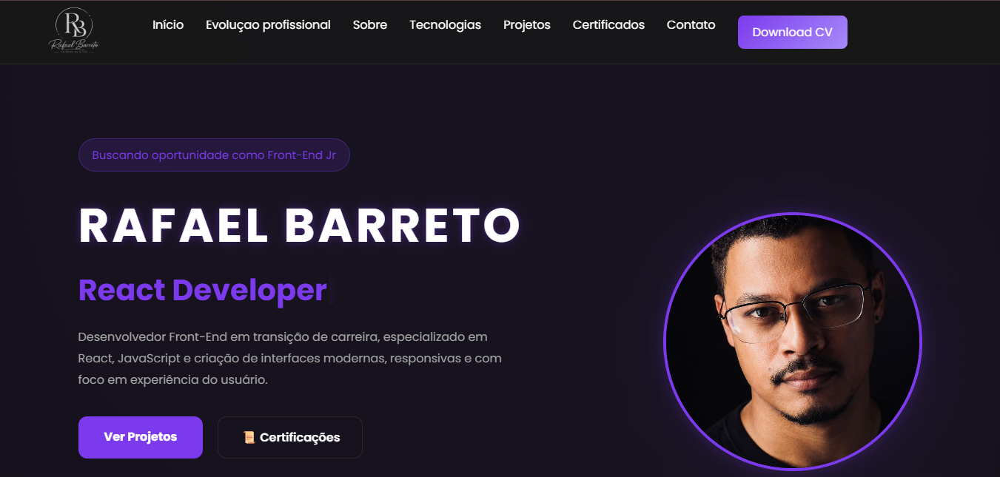

<div align="center">

# 💼 Rafael Barreto | Portfolio

### Desenvolvedor Front-End

Portfólio profissional desenvolvido em React + Vite para apresentar meus projetos, habilidades, experiência e trajetória como desenvolvedor.

---

[](https://react.dev/)
[](https://vitejs.dev/)
[](https://developer.mozilla.org/)
[](https://developer.mozilla.org/)
[](https://www.netlify.com/)

### 🌐 Acesse

**https://rafaelbarretoportifolio.netlify.app/**

</div>

---

# 📖 Sobre o projeto

Este projeto foi desenvolvido com o objetivo de representar minha identidade como Desenvolvedor Front-End.

Ao invés de criar apenas um currículo online, busquei desenvolver uma aplicação moderna, responsiva e agradável visualmente, destacando minhas principais habilidades técnicas, projetos e experiência.

O foco do desenvolvimento foi entregar uma experiência fluida através de animações, organização visual e boas práticas de desenvolvimento utilizando React.

O site também funciona como meu portfólio principal para recrutadores, clientes e empresas.

---

# ✨ Funcionalidades

✔ Página inicial com apresentação profissional

✔ Seção "Sobre Mim"

✔ Timeline da minha trajetória

✔ Tecnologias que domino

✔ Projetos desenvolvidos

✔ Certificações

✔ Área para freelancers

✔ Formulário de contato

✔ Download do currículo

✔ Links para GitHub e LinkedIn

✔ Layout totalmente responsivo

---

# 🚀 Tecnologias utilizadas

## Front-end

- React
- JavaScript (ES6+)
- Vite
- HTML5
- CSS3

## Bibliotecas

- Framer Motion
- GSAP
- EmailJS

## Ferramentas

- Git
- GitHub
- Netlify
- VS Code

---

# 📂 Estrutura do projeto

```
portfolio/

│

├── public/

│   ├── certificados/

│   ├── projetos/

│   ├── logo.png

│   ├── preview.png

│   ├── Rafael Barreto CV.pdf

│   └── Rafael.jpeg

│

├── src/

│   ├── components/

│   │

│   ├── About.jsx

│   ├── Certificates.jsx

│   ├── Contact.jsx

│   ├── Footer.jsx

│   ├── Freelancer.jsx

│   ├── Hero.jsx

│   ├── Navbar.jsx

│   ├── Projects.jsx

│   ├── Technologies.jsx

│   └── Timeline.jsx

│

├── App.jsx

├── main.jsx

└── index.css
```

---

# 📸 Preview

<p align="center">



</p>

---

# ⚙ Como executar o projeto

Clone o repositório

```bash
git clone https://github.com/rafaelbarreto95/NOME-DO-REPOSITORIO.git
```

Entre na pasta

```bash
cd NOME-DO-REPOSITORIO
```

Instale as dependências

```bash
npm install
```

Execute

```bash
npm run dev
```

Para gerar a versão de produção

```bash
npm run build
```

---

# 📁 Organização dos componentes

### Hero.jsx

Responsável pela apresentação inicial do portfólio.

---

### About.jsx

Exibe informações pessoais, trajetória e objetivos profissionais.

---

### Timeline.jsx

Linha do tempo mostrando minha evolução profissional.

---

### Technologies.jsx

Lista das tecnologias e ferramentas que utilizo.

---

### Projects.jsx

Apresenta meus principais projetos com descrição e links.

---

### Certificates.jsx

Exibe minhas certificações.

---

### Freelancer.jsx

Área dedicada aos meus serviços como desenvolvedor freelancer.

---

### Contact.jsx

Formulário de contato integrado ao EmailJS.

---

### Footer.jsx

Informações finais e redes sociais.

---

# 🎯 Objetivos deste projeto

Este projeto foi desenvolvido para:

- Consolidar conhecimentos em React

- Praticar componentização

- Melhorar organização de código

- Criar uma identidade profissional

- Disponibilizar meus projetos em um único lugar

- Servir como apresentação para empresas e clientes

---

# 📈 Melhorias futuras

- Dark/Light Mode

- Internacionalização (Português / Inglês)

- Blog integrado

- Dashboard para gerenciamento de projetos

- Testes automatizados

- Melhorias de acessibilidade

- SEO avançado

---

# 👨‍💻 Autor

## Rafael Barreto

Desenvolvedor Front-End apaixonado por tecnologia, interfaces modernas e criação de experiências digitais.

### Contato

📧 **Email**

rafael.bsilva95@outlook.com

💼 **LinkedIn**

https://www.linkedin.com/in/rafael-barreto-silva/

🐱 **GitHub**

https://github.com/rafaelbarreto95

🌐 **Portfólio**

https://rafaelbarretoportifolio.netlify.app/

---

<div align="center">

### ⭐ Se este projeto te ajudou ou você gostou do trabalho, deixe uma estrela no repositório.

Obrigado pela visita!

</div>
